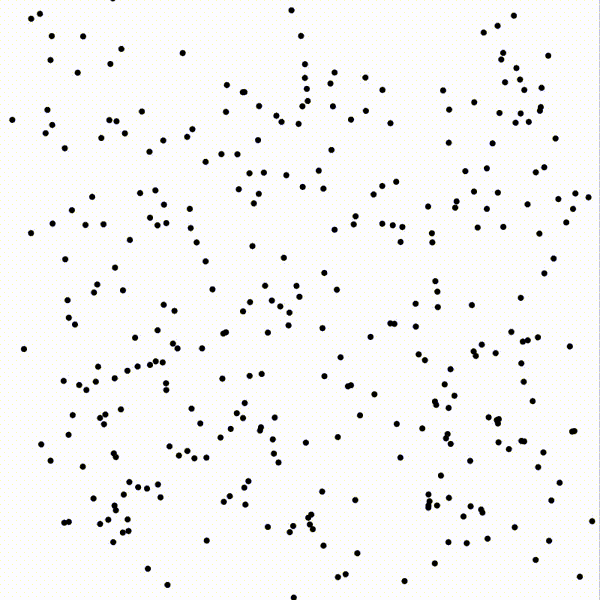

# Concurrent N-Body Simulation
> The project was done for a course in concurrent programming at KTH.

The project evaluates two different methods of approximating an N-Body system.
1. Brute force
   
   This is the naive and initial approach of solving a problem like this. It is very inefficient but pretty easy to parallelize.

2. Barnes-Hut

   This is a well known approximation method that works by dividing the bodies in sections that are either near or far away. If a cluster of bodies are far away, their effect on a specific body can be approximated as if the cluster was a single body positioned at the center of gravity.

The project also included parallelizations of the above mentioned methods with comparisons of their efficiency. More information and the conclusions can be found in the project [report](N-Body_Report.pdf).

<p align="center">
  
</p>

## Usage example
To run a simple test make the first program and wait for it to finish calculating. After it is done, a visualization window will pop up.

```sh
make 1
```

## Development setup

OpenGL and a C compiler is required for this project to run. Please make sure that you have the neccesary tools.


## Meta

Erik Båvenstrand – [Portfolio](https://bavenstrand.se) – erik@bavenstrand.se

Distributed under the MIT license. See ``LICENSE`` for more information.

[github.com/ErikBavenstrand](https://github.com/ErikBavenstrand)
